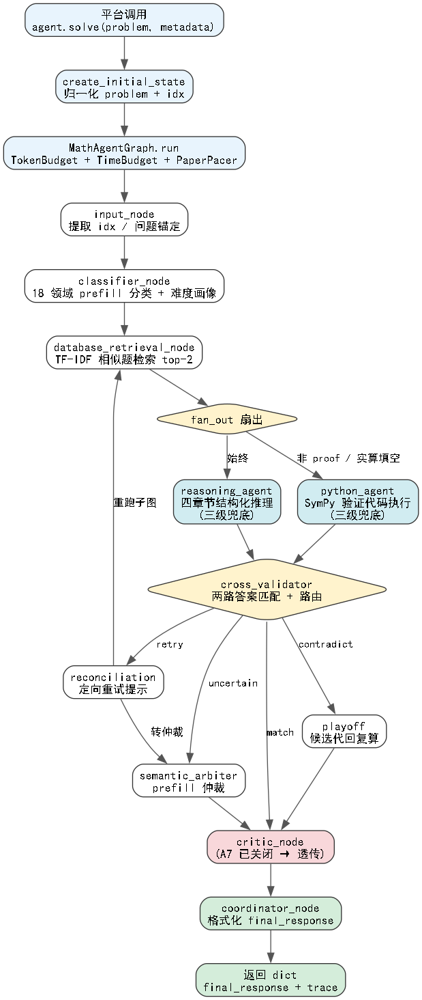
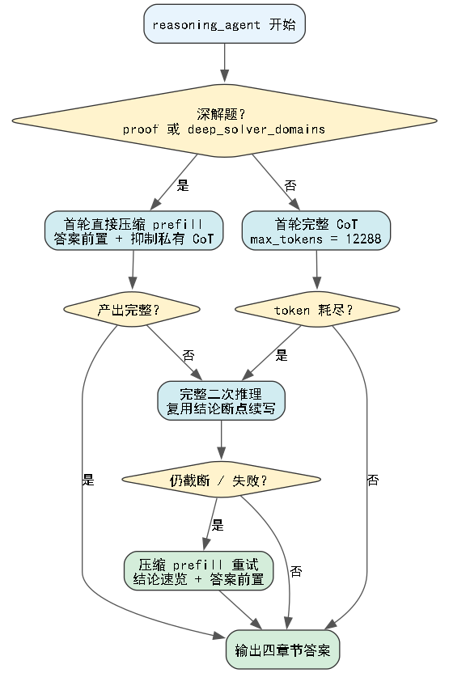

# 🏗️ Math-Agent-System 架构与调用流程（A9）

> 本文讲解系统的完整调用链路：从竞赛平台调用 `ReasoningAgent.solve` 开始，到 LangGraph
> 多智能体图编排、推理/验证双路并行、交叉验证、仲裁与收尾的端到端流程。

---

## 1. 系统分层

整个系统分三层，逐层收敛：

| 层 | 文件 | 职责 |
|---|---|---|
| **入口层** | `user_agent.py` | 平台固定接口：`__init__(client)` + `solve(problem, metadata)`，归一化入参、驱动图、组装 trace |
| **图运行层** | `graph/main_graph.py` | `MathAgentGraph.run()`：注入 TokenBudget / TimeBudget / PaperPacer / 检索器，执行编译后的图 |
| **图执行层** | `graph/main_graph.py` + `graph/solving_subgraph.py` + `graph/nodes/*` | LangGraph 节点与条件路由，真正的求解逻辑 |

---

## 2. 总览流程图



> 源文件：`diagrams/flow_main.dot`（Graphviz，可用 `dot -Tpng diagrams/flow_main.dot -o diagrams/flow_main.png` 重新渲染）。

---

## 3. 入口层：`user_agent.py`

```python
class ReasoningAgent:
    def __init__(self, client, *args, **kwargs):
        self.skills_loader = SkillsLoader()      # 18 领域 skill 文档
        self.mcp_client    = PythonMCPClient()   # Python 执行客户端
        self.graph         = MathAgentGraph(client, skills_loader, mcp_client)

    def solve(self, problem, metadata=None, *args, **kwargs) -> dict:
        initial = create_initial_state(str(problem), meta)
        final_state = self.graph.run(initial, token_budget=TokenBudget())
        return {"final_response": ..., "trace": self._build_trace(final_state)}
```

**入口防御**（平台加载形态不可控，全部兜底）：
- `metadata` 兼容 `None` / 位置参数 / 非 dict；
- 暴露 `__call__` / `run` 别名，`agent(problem)` 与 `agent.run(problem)` 等价；
- `sys.path` 自举：被 importlib 按路径加载时自动找到 `graph` / `utils` 包；
- `_validate_output` 保证返回 `dict` + 非空 `final_response` + 可 JSON 序列化。

---

## 4. 图运行层：`MathAgentGraph.run()`

每次 `solve` 调用都走一遍，为**单题**建立独立预算与依赖：

1. `TokenBudget()`：token 预算（`token_budget_max=256000`）；
2. `TimeBudget()`：**每题一个时钟**，所有节点共享同一时间原点（平台按墙钟判超时）；
3. `PaperPacer.get_instance()`：全卷完成率引擎，按「剩余全卷时间 ÷ 剩余题数」动态计算本题软预算 `paper_cap`，并 `mark_started(idx)`；
4. 惰性创建 `TfidfRetriever`（RAG 检索器，失败降级为 `None`，不影响求解）；
5. 组装 `Deps(client, skills_loader, mcp_client, token_budget, time_budget, retriever)`；
6. `app.invoke(initial_state, config={"configurable": {"deps": deps}})` 执行图；
7. `finally` 里 `PaperPacer.mark_done()` 计数（每题结束都计数，驱动全卷节奏）。

> **PaperPacer 是完成率保险**：112 题、6h 硬限、平台并发 3。若前面题超时，后面题软预算被收紧，保证 6h 内每道题都产出答案（完成率 100% > 单题完美）。

---

## 5. 主图节点与条件路由

主图由 `build_math_agent_graph()` 编译，节点与路由如下：

| 节点 | 职责 | 说明 |
|---|---|---|
| `input` | 提取 idx、问题锚定 | SHA256 锚定题面，零成本 |
| `classifier` | 18 领域分类 + 难度画像 | prefill 调用（~1s/12 tokens），失败走确定性关键词回退 |
| `solving` | **子图**（见第 6 节） | 检索 + 推理/验证并行 + 交叉验证 |
| `reconciliation` | 生成定向重试提示 | 冲突且预算允许时重跑子图 |
| `semantic_arbiter` | prefill 仲裁 | 从既有候选里选最完整答案（只能选/弃权，不生成） |
| `playoff` | 确定性复算裁决 | 候选代回核验（回代残差/枚举对照/存在性搜索） |
| `critic` | 过程审计门 | A8 恢复开启：契约完整性 + 计算抽核 + 推导矛盾自检（客观题零成本早退） |
| `coordinator` | 格式化 final_response | 汇总推理步骤 + 验证结果 + 最终答案 |

**`solving` 之后的五种路由**（`route_after_solving`）：

| 交叉验证结果 | 下一节点 |
|---|---|
| `should_terminate` / `match` | `critic` → `coordinator` |
| `contradict` | `playoff` |
| `uncertain` | `semantic_arbiter` |
| `retry`（预算可负担） | `reconciliation` |

`playoff` / `semantic_arbiter` / `reconciliation` / `critic` 之间可以互跳（如仲裁失败→重试，季后赛无果→仲裁），但**所有路径最终收敛到 `coordinator` → END**，保证每题必产出答案（A3 官方评测 0 invalid 的机制保障）。

---

## 6. 子图 `solving`：检索 + 双路并行 + 交叉验证

子图链路：`database_retrieval` → `fan_out` 扇出 → `reasoning_agent`（始终）/ `python_agent`（需验证时）并行 → `cross_validator` 匹配 → 回主图路由。此链路已在 [第 2 节总览图](#2-总览流程图) 中完整呈现，此处不再单独绘图。

### 6.1 `database_retrieval`（纯增益节点）

用原题检索竞赛题库（`data/retrieval_corpus.json`，1555 条），TF-IDF `char_wb` n-gram 2-5 特征，取 top-2 条题面+解答作为 few-shot 参考注入推理与验证两个子代理。**反锚定机制**：近似题结论不可照抄，只借鉴方法、显式对比参数差异。检索失败降级为空列表，绝不影响求解。

### 6.2 `fan_out` 扇出规则

| 条件 | 行为 |
|---|---|
| `question_mode == proof` | **单路径**（跳过 Python，抽象命题无法数值验证） |
| 客观题高置信（`fast_lane_eligible`） | 单路径快速答 |
| 高置信纯概念客观题（`can_skip_python_verify`） | 单路径 |
| 实算填空（`needs_python_verify`） | 升级**双路**验证 |
| 常规计算题 | **双路**并行 |

### 6.3 `reasoning_agent` 与 `python_agent`（并行）

两路并行执行，各自产出独立答案，交给 `cross_validator` 对比：

- **reasoning**：加载领域 skill → 四章节结构化输出（`## 问题分析` / `## 详细解题步骤` / `## 最终答案` / `## 关键验证点`）；
- **python**：**注入候选核验**（A4 基线，A9 恢复）——注入 reasoning 候选答案生成 SymPy 验证代码；候选为空时切换**独立求解器框架**（A9 条件求解器）直接算出答案；运筹学题注入 scipy.optimize 求解器模板（A9 运筹学守卫）。子进程隔离执行 → 从 stdout 抽取答案（计数题注入枚举对照，modular_guard 模结构核查 A8 恢复开启）。

---

## 7. 推理三级兜底（截断难题的挽救链）

深度推理模型 `intern-s2-preview-397b` 的私有 CoT 计入 `max_tokens`，难题可能耗尽额度却没写出答案。三级兜底如下：



> 源文件：`diagrams/flow_retry.dot`。

- **首轮 `max_tokens=8192`**（A8 从 A7 的 12288 回退）：环境静默 cap 8192，提上限无效；截断靠 prefill 压私有 CoT 来降，而非提 max_tokens；
- **完整二次推理**：`can_afford_retry` 放行时，用普通调用（保留私有思考）复用首轮结论断点续写；
- **压缩 prefill 重试**：`## 结论速览\n\boxed{` 种子抑制私有推理，全部额度用于可见章节，答案前置（截断也不丢答案）。

Python 侧对称实现三级兜底：首轮完整生成 → 完整重生成（`full_retried` 只一次）→ 压缩重生成。

---

## 8. 关键机制速览

| 机制 | 文件 | 作用 |
|---|---|---|
| **prefill 抑制 CoT** | `utils/llm/prefill.py` | 分类器/仲裁器/压缩重试用助手种子抑制私有推理（58~140× 提速） |
| **响应归一化 + 签名探测** | `utils/llm/response_normalize.py` | 兼容平台 client 的任意返回形态与调用签名 |
| **PaperPacer** | `utils/budget/paper_pacer.py` | 全卷 6h 完成率引擎 |
| **AnswerMatcher + 契约** | `utils/answer/matcher.py`、`contract.py` | 数值/符号答案匹配 + 多空契约完整性 |
| **确定性守卫组** | `utils/verify/*` | 计数枚举 / 判断题确认 / 形式对齐 / 证明补强等零成本兜底 |
| **RAG 检索** | `utils/retrieval/tfidf_client.py` | TF-IDF 相似题 few-shot 注入 |

---

## 9. A9 版本改动标记

A8 官方 67.86 分（76/112），比 A4 基线（82/112）净 **−6 题**——「去锚定 + 运筹学压缩」两条假设双双证伪（① 第一名「工具执行 67% vs 心算 34%」数据已验证为错误；② 运筹学首轮压缩抑制 CoT 致 Python 代码质量下降）。A9 先**回退 A8 恢复 A4 基线**，再做两个**严格非负、零额外 LLM 调用**的定向优化：

| 改动 | 影响节点 | 说明 |
|---|---|---|
| `python_independent_solve` True → **False** | python_exec / cross_validator | 回退：去锚定负收益 −6 题，Python 恢复「注入候选核验」的 A4 验证器定位 |
| `deep_solver_domains` 移除「运筹学」 | reasoning / python_exec | 回退：运筹学首轮压缩抑制 CoT 致 3 题仍全错，压缩只保留数论/组合/高代/抽代 |
| `enable_python_solver_fallback = True` | python_exec | 条件求解器：候选为空时改用独立求解器 prompt（`PYTHON_SOLVER_PROMPT`），候选非空仍核验——严格非负，不覆盖正确推理 |
| `enable_operations_research_guard = True` | python_exec | 运筹学守卫：命中运筹学题注入 linprog/minimize/milp 模板 + 静态核查（必须真调用求解器/枚举，纯手算闭式打回） |

### 9.1 A8 版本改动（已被 A9 回退）

A7 官方评测 68.75 分（77/112），比 A4 基线（73.21，82/112）倒退 5 题——A7 的两条假设（「提 max_tokens 降截断」「关 critic/modular_guard 减调用」）双双证伪。A8 先**回退 A7 恢复 A4 基线**，再做「计算题工具主解」：

| 改动 | 影响节点 | 说明 |
|---|---|---|
| `max_tokens` 12288 → **8192** | reasoning / python / compressed | 回退：环境静默 cap 8192，提上限是自欺（token 反推铁证） |
| `enable_critic = True` | critic | 恢复：关掉实测 -5 题，契约完整性审计有正向价值 |
| `enable_modular_guard = True` | python_exec | 恢复：F₂/Z_m 模结构确定性防线，关掉实测 -5 题 |
| `python_independent_solve = True` | python_exec / cross_validator | 去锚定：Python 不注入 reasoning 候选，独立求解释放工具执行 67% vs 心算 34%（A9 证伪回退） |
| `deep_solver_domains` 加「运筹学」 | reasoning / python_exec | 运筹学题首轮直接压缩 prefill，省时间给 Python 建模求解（A9 证伪回退） |

`classifier` / `semantic_arbiter`（96）与 `emergency_answer`（1280）仍用小 cap 抑制私有 CoT，未改动。
